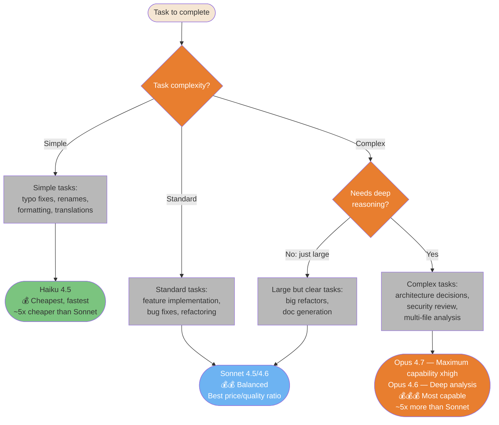
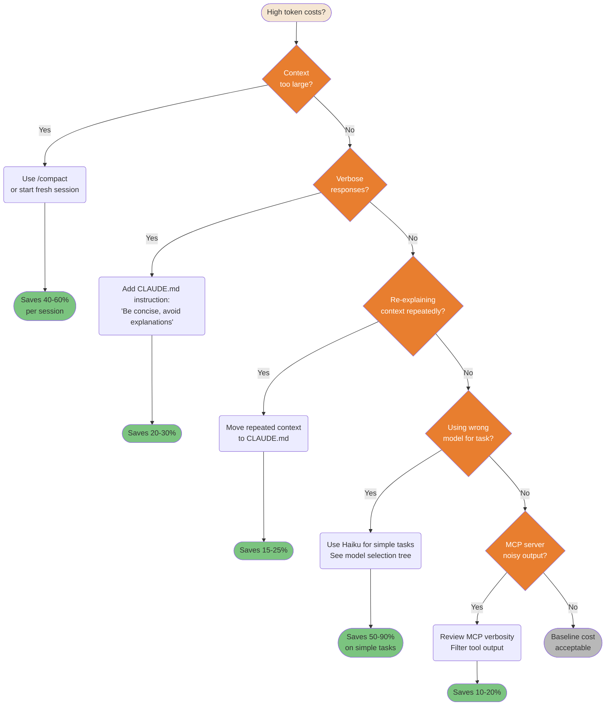
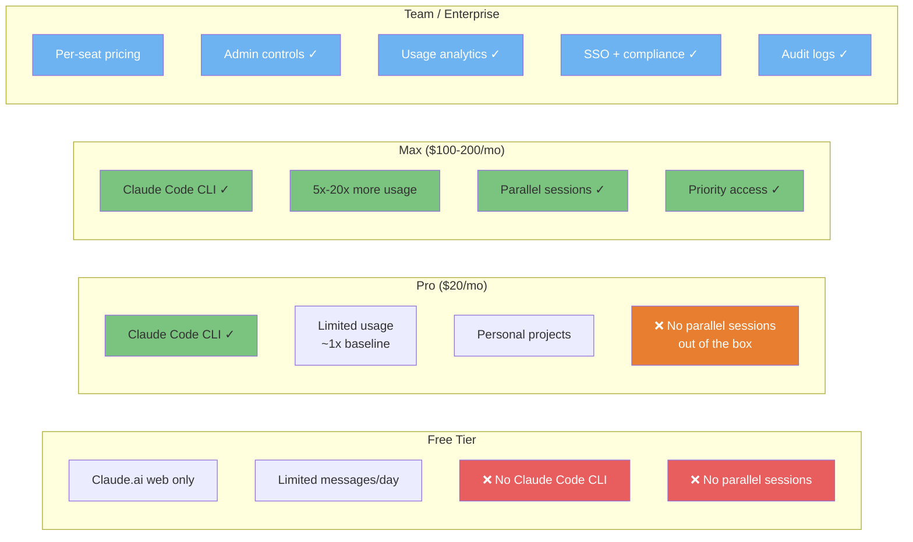

# Cost & Optimization

How to get maximum value from Claude Code while controlling token consumption and costs.

---

### Model Selection Decision Flow

Not all tasks need the most powerful model. Using the right model for the right task cuts costs by 5-10x without sacrificing quality.

> **This diagram assumes an unconstrained budget (Max/API).** On tighter plans (Pro, Teams Standard), apply the budget modifier below.



> **Pricing**: Relative costs shown — check current rates at [anthropic.com/pricing](https://www.anthropic.com/pricing).

**Budget modifier** — On constrained plans, downgrade one tier per phase:

| Plan | Planning phase | Implementation phase |
|------|---------------|---------------------|
| **Max / API unconstrained (xhigh)** | Opus 4.7 | Sonnet |
| **Max / API unconstrained** | Opus 4.6 | Sonnet |
| **Pro / Teams Standard** | Sonnet | Haiku (mechanical tasks) |
| **API tight budget** | Sonnet | Haiku |

> *Community pattern (Teams Standard $25/mo): Sonnet for Plan → Haiku for Implementation. Same quality output on mechanical tasks at a fraction of the cost.*

<details>
<summary>ASCII version</summary>

```
Task complexity?
├─ Simple (typos, format, rename) → Haiku 4.5       ($  — ~5x cheaper than Sonnet)
├─ Standard (features, bugs)      → Sonnet 4.5/4.6  ($$ — best price/quality ratio)
└─ Complex (architecture, sec.)
   ├─ Needs deep reasoning?        → Opus 4.7 (xhigh) / Opus 4.6  ($$$ — ~5x more than Sonnet)
   └─ Just large/clear?            → Sonnet 4.6                    ($$ — handles it)

Budget modifier (downgrade one tier on constrained plans):
  Max/API (xhigh)  → Opus 4.7 plan, Sonnet impl
  Max/API          → Opus 4.6 plan, Sonnet impl
  Pro/Teams        → Sonnet plan, Haiku impl (mechanical tasks)
```

</details>

> **Source**: [Model Selection](../ultimate-guide.md#model-selection) — Line ~2634

---

### Cost Optimization Decision Tree

High token costs are usually fixable. This systematic tree identifies the root cause and points to the right fix for each waste pattern.



<details>
<summary>ASCII version</summary>

```
High costs?
├─ Context too large?      → /compact or new session    (40-60% saving)
├─ Verbose responses?      → CLAUDE.md: be concise      (20-30% saving)
├─ Repeating context?      → Move to CLAUDE.md          (15-25% saving)
├─ Wrong model?            → Use Haiku for simple tasks (50-90% saving)
├─ Noisy MCP output?       → Filter tool output         (10-20% saving)
└─ None of the above?      → Baseline cost, acceptable
```

</details>

> **Effort slider** — `/effort xlow/low/default/high/xhigh` (v2.1.111) lets you tune thinking depth per task. Lower effort = fewer tokens consumed on thinking. Combine with model selection for fine-grained cost control.

> **Source**: [Cost Optimization](../ultimate-guide.md#cost-optimization) — Line ~8878

---

### Subscription Tiers — What Each Unlocks

Different tiers unlock different Claude Code capabilities. Knowing the limits helps you plan usage and justify upgrades.



<details>
<summary>ASCII version</summary>

```
FREE         PRO ($20)        MAX ($100-200)   TEAM/Enterprise
────         ─────────        ──────────────   ───────────────
Web only     CLI ✓            CLI ✓            Per-seat
Limited msgs Limited usage    5-20x usage      Admin controls
No CLI       Personal use     Parallel ✓       Analytics
             No parallel      Priority ✓       SSO + compliance
```

</details>

> **Source**: [Subscription Tiers](../ultimate-guide.md#subscription-tiers) — Line ~1933

---

### Token Reduction Strategies Pipeline

Multiple strategies stack for cumulative token savings. Apply them in order from highest impact to lowest effort.

```mermaid
flowchart LR
    BASE([Baseline:<br/>100% tokens]) --> RTK

    subgraph RTK["Strategy 1: RTK Proxy"]
        R1[Raw CLI output<br/>→ filtered output]
        R2["git status, cargo test,<br/>pnpm list → compressed"]
        R3[Saves 60-90%<br/>on CLI commands]
    end

    RTK --> COMP

    subgraph COMP["Strategy 2: /compact"]
        C1[Long conversation<br/>→ summarized]
        C2[Keep decisions,<br/>drop verbose reasoning]
        C3[Saves 40-60%<br/>at checkpoint]
    end

    COMP --> CLAUDE_MD

    subgraph CLAUDE_MD["Strategy 3: CLAUDE.md"]
        CM1[Repeated context<br/>→ persistent instructions]
        CM2[No re-explaining<br/>project conventions]
        CM3[Saves 15-25%<br/>per session]
    end

    CLAUDE_MD --> MODEL

    subgraph MODEL["Strategy 4: Model Selection"]
        MO1[Haiku for simple tasks<br/>instead of Sonnet]
        MO2[Same quality output<br/>at fraction of cost]
        MO3[Saves 50-90%<br/>on simple tasks]
    end

    MODEL --> RESULT([Optimized:<br/>10-20% of baseline<br/>for typical usage])

    style BASE fill:#E85D5D,color:#fff
    style R3 fill:#7BC47F,color:#333
    style C3 fill:#7BC47F,color:#333
    style CM3 fill:#7BC47F,color:#333
    style MO3 fill:#7BC47F,color:#333
    style RESULT fill:#7BC47F,color:#333

    click BASE href "https://github.com/FlorianBruniaux/claude-code-ultimate-guide/blob/main/guide/ultimate-guide.md#913-cost-optimization-strategies" "Baseline: 100% tokens"
    click R1 href "https://github.com/FlorianBruniaux/claude-code-ultimate-guide/blob/main/guide/ultimate-guide.md#913-cost-optimization-strategies" "Raw CLI output filtered"
    click R2 href "https://github.com/FlorianBruniaux/claude-code-ultimate-guide/blob/main/guide/ultimate-guide.md#913-cost-optimization-strategies" "RTK commands"
    click R3 href "https://github.com/FlorianBruniaux/claude-code-ultimate-guide/blob/main/guide/ultimate-guide.md#913-cost-optimization-strategies" "Saves 60-90% on CLI"
    click C1 href "https://github.com/FlorianBruniaux/claude-code-ultimate-guide/blob/main/guide/ultimate-guide.md#913-cost-optimization-strategies" "Long conversation summarized"
    click C2 href "https://github.com/FlorianBruniaux/claude-code-ultimate-guide/blob/main/guide/ultimate-guide.md#913-cost-optimization-strategies" "Keep decisions"
    click C3 href "https://github.com/FlorianBruniaux/claude-code-ultimate-guide/blob/main/guide/ultimate-guide.md#913-cost-optimization-strategies" "Saves 40-60% at checkpoint"
    click CM1 href "https://github.com/FlorianBruniaux/claude-code-ultimate-guide/blob/main/guide/ultimate-guide.md#31-memory-files-claudemd" "Repeated context persistent"
    click CM2 href "https://github.com/FlorianBruniaux/claude-code-ultimate-guide/blob/main/guide/ultimate-guide.md#31-memory-files-claudemd" "No re-explaining conventions"
    click CM3 href "https://github.com/FlorianBruniaux/claude-code-ultimate-guide/blob/main/guide/ultimate-guide.md#913-cost-optimization-strategies" "Saves 15-25% per session"
    click MO1 href "https://github.com/FlorianBruniaux/claude-code-ultimate-guide/blob/main/guide/ultimate-guide.md#25-model-selection--thinking-guide" "Haiku for simple tasks"
    click MO2 href "https://github.com/FlorianBruniaux/claude-code-ultimate-guide/blob/main/guide/ultimate-guide.md#25-model-selection--thinking-guide" "Same quality at lower cost"
    click MO3 href "https://github.com/FlorianBruniaux/claude-code-ultimate-guide/blob/main/guide/ultimate-guide.md#25-model-selection--thinking-guide" "Saves 50-90% on simple"
    click RESULT href "https://github.com/FlorianBruniaux/claude-code-ultimate-guide/blob/main/guide/ultimate-guide.md#913-cost-optimization-strategies" "Optimized: 10-20% of baseline"
```



<details>
<summary>ASCII version</summary>

```
100% baseline
    │
RTK proxy (CLI output compression)  → -60-90% on CLI ops
    │
/compact (conversation summarization) → -40-60% at checkpoint
    │
CLAUDE.md (avoid repeated context)    → -15-25% per session
    │
Model selection (Haiku for simple)    → -50-90% on simple tasks
    │
~10-20% of baseline for typical usage
```

</details>

> **Track usage** — Use `/usage` to monitor token consumption and costs (replaces `/cost` as of v2.1.118; `/cost` remains a valid alias).

> **Source**: [Token Optimization](../ultimate-guide.md#token-optimization) — Line ~13355
